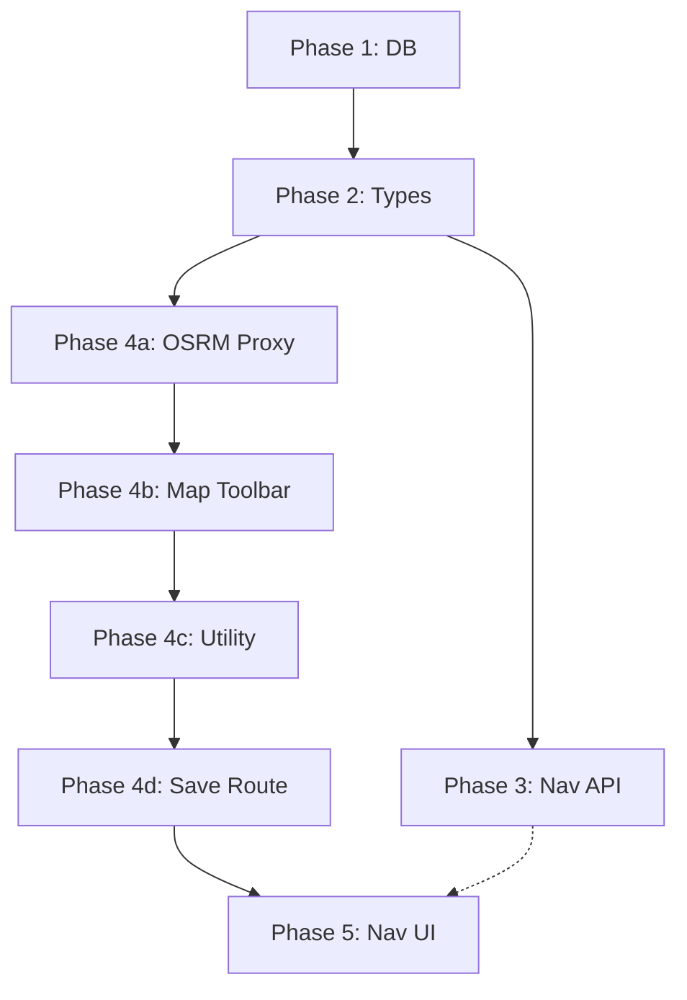

# Implementation Plan: Navigation Algorithm & Route Recording

## Phase 1 — Database Migrations

**New file:** `supabase/migrations/<timestamp>_navigation_schema.sql`

- [ ] Add `mode_segments` column to `route` table:
  ```sql
  ALTER TABLE route ADD COLUMN mode_segments JSONB DEFAULT NULL;
  ```
- [ ] Create GIST index for geometry:
  ```sql
  CREATE INDEX IF NOT EXISTS route_geometry_gist ON route USING GIST (geometry);
  ```
- [ ] Update `src/lib/types/database.ts`:
  - Add `mode_segments: Json | null` to the `route` row type.

---

## Phase 2 — Schema & Type Updates

**Update:** `src/lib/validation/schemas.ts`

- [ ] Add `'Walk'` to `routeVehicleTypeOptions` (valid in mode markers, not in metadata form checklist).
- [ ] Add `ModeSegment` type:
  ```typescript
  type ModeSegment = {
    mode: RouteVehicleType;
    from: [number, number];
    to: [number, number];
  };
  ```
- [ ] Extend `mapRouteCreateSchema` with optional `mode_segments`:
  ```typescript
  mode_segments: z.array(modeSegmentSchema).optional();
  ```

---

## Phase 3 — Navigation API

**New file:** `src/routes/api/navigate/+server.ts` — `GET /api/navigate?from=&to=`

Implement the 6-step BFS server-side:
1. **Resolve coordinates:** from/to names → coordinates via `ILIKE` on `start_loc`/`end_loc`, extract `ST_StartPoint`/`ST_EndPoint`.
2. **Seed frontier:** `ST_DWithin(geometry, origin, 800)`, check for zero-transfer direct hit.
3. **BFS expand:** `ST_DWithin(r.geometry, current_geometry, 800)`, track parent pointers.
4. **Direction constraint:** `ST_LineLocatePoint(alight) > ST_LineLocatePoint(board)`.
5. **Depth cap:** Limit at 3 transfers.
6. **Path reconstruction:** Clip geometry per leg with `ST_LineSubstring`.

> [!NOTE]
> Response shape matches spec §2d. No-route: `{ itinerary: null, message: "no_route_found" }`.
> OSRM calls go through a backend proxy endpoint — never called directly from client.

---

## Phase 4 — Route Recording Improvements

### 4a. OSRM Proxy
- [ ] `src/routes/api/osrm/route/+server.ts`: Proxies snap-to-road calls.
- [ ] `src/routes/api/osrm/match/+server.ts`: Proxies map-matching calls.

### 4b. Map.svelte Trace Toolbar
- [ ] Add mode picker UI: "Manual Trace" vs "Record live" before tracing begins.
- [ ] **Mode A (Manual):** After each tap, call `/api/osrm/route` with `profile=driving` (or `foot` for Walk segments); replace straight segment with returned LineString.
- [ ] **Mode B (Live GPS):** `watchPosition` → Haversine 10m threshold → accumulate points → on Stop, `POST` to `/api/osrm/match`.
- [ ] Add "Change mode" button → bottom sheet picker → drops `ModeMarker` at current point index.
- [ ] Color-code segments: Walk = dashed gray, transit = solid colored.
- [ ] Undo removes last point + its marker if any.

### 4c. buildModeSegments Utility
- [ ] `src/lib/utils/buildModeSegments.ts`:
  ```typescript
  function buildModeSegments(points, markers): ModeSegment[]
  ```
- [ ] Integration: Called before `RouteTraceSaveDrawer` opens; result passed alongside metadata to `POST /api/map/routes`.

### 4d. Update POST /api/map/routes
- [ ] `src/routes/api/map/routes/+server.ts`: Accept and save `mode_segments` if present.

---

## Phase 5 — Navigation UI

### 5a. From/To Search Bar
- [ ] New component: `src/lib/components/map/NavigationSearchBar.svelte`.
- [ ] Two inputs using same `ILIKE` search as existing `MapSearchBar`.
- [ ] On submit → calls `GET /api/navigate` → shows `RouteLoaderBar`.

### 5b. Pre-navigation Result Display
**In `Map.svelte`:**
- [ ] Render Walk legs: dashed gray line.
- [ ] Render Ride legs: solid colored clipped LineString.
- [ ] Bottom card: step-by-step itinerary + summary row.
- [ ] "Start Navigation" button.

### 5c. Live Navigation Mode
- [ ] `watchPosition` → `map.easeTo({ center, bearing })` on each fix.
- [ ] Bearing from `GeolocationCoordinates.heading` or computed from last two positions.
- [ ] Zoom 17, pitch 45°.
- [ ] Re-center button when user pans away.
- [ ] Current leg highlighted; completed legs dimmed.

### 5d. "I've arrived" & Combined Route Save
- [ ] Ends navigation, returns camera to north-up.
- [ ] If ≥2 ride legs: prompt to save combined route.
- [ ] Pre-fills `RouteTraceSaveDrawer`: concatenated geometry, auto `mode_segments`, merged `vehicle_types`, summed fares + ETAs.

---

## Build Order



> [!TIP]
> Phases 3 and 4 can be built in parallel since they're decoupled (Phase 3 reads `mode_segments`; Phase 4 produces it).